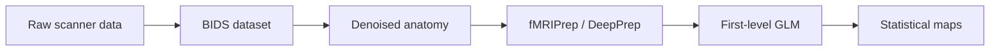

<div align="center">


# 🧠 NeuroSpin Laboratories

**From raw scanner and eye-tracker data to statistical brain maps** — the code and setup notes behind fMRI and MEG studies at NeuroSpin.

[](LICENSE)
[](MEG/Eye-Tracking/NOTES.md)


</div>

> [!NOTE]
> This is an **unofficial, community-maintained** repository, put together by **Alireza Karami** — it is not an official publication of NeuroSpin or the CEA. Responsibility for the code and instructions below rests with the maintainer alone; see [Acknowledgments](#-acknowledgments) for the colleagues whose expertise helped shape it.

## 📖 Table of Contents

- [🧠 About This Repository](#-about-this-repository)
- [📁 Repository Structure](#-repository-structure)
- [🔬 fMRI Pipeline](#-fmri-pipeline)
  - [Preprocessing](#preprocessing)
  - [Analysis](#analysis)
- [👀 MEG · Eye-Tracking](#-meg--eye-tracking)
- [🔧 Requirements & Setup](#-requirements--setup)
- [🙏 Acknowledgments](#-acknowledgments)
- [📜 License](#-license)
- [💬 Questions & Contact](#-questions--contact)

---

## 🧠 About This Repository

[NeuroSpin](https://joliot.cea.fr/drf/joliot/en/research/NeuroSpin) is a CEA Paris-Saclay research center in Gif-sur-Yvette, France, dedicated to pushing the boundaries of brain imaging — high-field MRI, MEG, and EEG — in the service of cognitive and clinical neuroscience. This repository is a working toolbox of the scripts, notebooks, and setup notes actually used inside its labs, covering the full arc of a study: from wiring up an eye tracker during acquisition to turning raw scanner output into statistical brain maps.

Two modalities are currently covered:

- 🔬 **fMRI** — raw scans → BIDS → denoised anatomy → fMRIPrep / DeepPrep → first-level GLM
- 👀 **MEG eye-tracking** — driving an SR Research EyeLink tracker during a MEG session, then parsing and visualizing the gaze data it produces

> [!TIP]
> Several of the notebooks are written as **fill-in-the-blank templates** rather than one-click pipelines — look for bracketed placeholders like `[ROOT_FOLDER]` or `[PARTICIPANT_ID]` and swap in your own study's paths before running them.

## 📁 Repository Structure

```text
NeuroSpin/
├── Files/
│   └── neurospin.jpg                     # Lab banner (shown above)
├── MEG/
│   └── Eye-Tracking/
│       ├── Files/                        # Example recordings + the PyLink wheel
│       │   ├── ss00r00.edf / ss00r00.asc
│       │   ├── ss00r01.edf / ss00r01.asc
│       │   └── sr_research_pylink-2.1.1130.0-cp312-cp312-linux_x86_64.whl
│       ├── NOTES.md                      # EyeLink + PyLink setup guide
│       ├── eyelink.py                    # EyeLinkWrapper — session & recording control
│       ├── eyelink_test.py               # Runnable demo experiment (expyriment)
│       └── parse.py                      # .asc parsing + gaze-path visualization
├── fMRI/
│   ├── Preprocessing/
│   │   ├── Preprocess.ipynb              # End-to-end preprocessing walkthrough
│   │   ├── mp2rage_uniden_generator.py   # MP2RAGE background denoising
│   │   ├── runNeurospin2BIDS.sh          # Raw scanner data → BIDS
│   │   ├── runfMRIprep.sh                # fMRIPrep, via Singularity
│   │   └── runDeepPrep.sh                # DeepPrep (GPU), via Singularity
│   └── Analysis/
│       └── 1stLevelAnalysis.ipynb        # Nilearn first-level GLM template
├── LICENSE                               # CC0 1.0 Universal
└── README.md
```

## 🔬 fMRI Pipeline

The fMRI side of the repo mirrors a typical study, start to finish:


```mermaid
flowchart LR
    A["Raw scanner data"] --> B["BIDS dataset"]
    B --> C["Denoised anatomy"]
    C --> D["fMRIPrep / DeepPrep"]
    D --> E["First-level GLM"]
    E --> F["Statistical maps"]
```

### Preprocessing

| File | What it does |
|---|---|
| `runNeurospin2BIDS.sh` | Wraps the `neurospin_to_bids` CLI to convert a raw NeuroSpin acquisition into a BIDS-compliant dataset — takes a root path, dataset name, and acquisition directory, and runs non-interactively with defacing enabled. |
| `mp2rage_uniden_generator.py` | A Python port of the classic **MP2RAGE UNI-DEN** algorithm. Combines the UNI image with its two inversion-time volumes (INV1/INV2) and a tunable noise factor to strip the salt-and-pepper background noise typical of MP2RAGE anatomicals, then writes out a clean NIfTI. |
| `runfMRIprep.sh` | Runs **fMRIPrep 22.0.2** inside a Singularity container, producing preprocessed BOLD data in both `T1w` and `MNI152NLin2009cAsym` space. |
| `runDeepPrep.sh` | Runs **DeepPrep 25.1.0** — a GPU-accelerated, deep-learning-based alternative to fMRIPrep — with CIFTI output across volumetric and surface (`fsaverage6`, `fsnative`) spaces. |
| `Preprocess.ipynb` | Stitches the four tools above into one walkthrough: build the import manifest → run NeuroSpin2BIDS → denoise the anatomy and patch its JSON sidecar → assemble field maps from the SBREF scans → flag phase-reconstruction files to skip → launch fMRIPrep. |

### Analysis

| File | What it does |
|---|---|
| `1stLevelAnalysis.ipynb` | A template for subject-level GLM analysis with **Nilearn**: build an events table (`trial_type`, `onset`, `duration`), configure and fit a `FirstLevelModel` (SPM-style HRF, cosine drift model, AR(1) noise model, optional masking/smoothing, fMRIPrep confound regression), then compute a contrast as a t/z-scored statistical map. |

## 👀 MEG · Eye-Tracking

Everything needed to run an SR Research **EyeLink** tracker alongside a MEG session, then make sense of the data afterwards.

- **`NOTES.md`** — the setup guide: install the EyeLink Developer's Kit, then install PyLink for **Python 3.12**, either from SR Research's package index or from the `.whl` file bundled in `Files/`.
- **`eyelink.py`** — the `EyeLinkWrapper` class, a clean interface over the raw `pylink` API. It detects your monitor, opens a fresh EDF file per experimental block, configures sample/event filters and saccade thresholds, walks through **HV9 calibration**, starts and stops recording with link-sample checks, and safely closes and transfers the EDF file when a session ends.
- **`eyelink_test.py`** — a runnable demo built with `expyriment`: it calibrates the tracker, then shows a circle jumping between six screen positions while gaze is recorded and each phase is message-tagged. A good smoke test for a new setup.
- **`parse.py`** — turns an EyeLink `.asc` export into tidy `pandas` DataFrames for **samples, fixations, saccades, blinks, and messages**, then plots a time-graded gaze path with fixation size/duration and saccade lines using Matplotlib (Plotly is imported too, ready for an interactive version).
- **`Files/`** — two example sessions (`ss00r00`, `ss00r01`), in both raw `.edf` and converted `.asc` form, so the pipeline above can be tried out immediately without a recording of your own.

**Quick example**, adapted from `eyelink_test.py`:

```python
from eyelink import EyeLinkWrapper

cfg = {
    "edf_file_base_name": "ss00",
    "background_color": (128, 128, 128),   # grey
    "foreground_color": (255, 255, 255),   # white
}

el = EyeLinkWrapper(cfg)
el.initialize()        # opens the first EDF file
el.calibrate()          # HV9 calibration

el.start_new_block()
el.start_recording()
el.send_message("Block 1 started")
# ... present your stimuli ...
el.stop_recording()
el.close()              # transfers the EDF file and disconnects
```

## 🔧 Requirements & Setup

There's no single lockfile here — the code spans a couple of different environments. Below is what each part actually imports, so you can set up only what you need.

**MEG / Eye-Tracking** (Python 3.12)
- [`pylink`](https://www.sr-research.com/) — SR Research's proprietary EyeLink SDK (see `NOTES.md` for install options)
- `screeninfo`, `expyriment` — monitor detection and stimulus presentation
- `pandas`, `numpy`, `matplotlib`, `plotly` — parsing and visualization

**fMRI**
- `numpy`, `nibabel` — MP2RAGE denoising
- `nilearn`, `pandas` — first-level GLM analysis
- [Singularity / Apptainer](https://apptainer.org/) — to run the fMRIPrep and DeepPrep containers
- A valid **FreeSurfer license file** — required by both preprocessing containers
- The `neurospin_to_bids` CLI — for the BIDS conversion step

## 🙏 Acknowledgments

Maintained by **Alireza Karami**. While putting these materials together, he drew on the insights and expertise of **Christophe Pallier**, **Fosca Al Roumi**, **Minye Zhan**, and **Bosco Taddei** — though, as noted above, responsibility for any errors in the code or guidelines remains his alone.

## 📜 License

Released under **[CC0 1.0 Universal](LICENSE)** — a public-domain dedication. Use it, adapt it, ship it: no attribution required.

## 💬 Questions & Contact

Spot a bug, have a question, or want to suggest an improvement? Feel free to [open an issue](https://github.com/alireza-kr/NeuroSpin/issues) on this repository.
