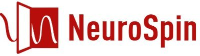

  

# NeuroSpin Laboratories
This repository provides code and detailed instructions developed for use in the NeuroSpin labs.

This is not an official NeuroSpin repository; it is maintained by Alireza Karami. While preparing these materials, I sometimes drew on the insights and expertise of Christophe Pallier, Fosca Al Roumi, Minye Zhan, and Bosco Taddei. However, all responsibilities for the code and guidelines remain solely with me.

Feel free to contact me if you have any questions.
